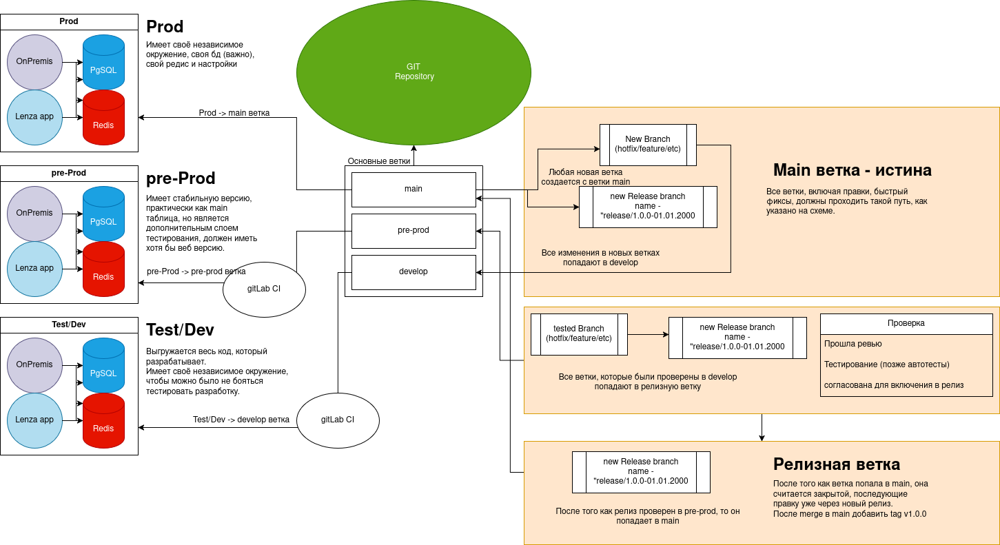

# Описание

## **Git Workflow и процесс доставки релизов**

Данная схема описывает архитектуру работы с Git, 
процесс формирования релизов и путь доставки изменений 
в различные окружения системы.

Основной принцип процесса — **ветка** *main* **является 
единственным источником стабильного production-кода**. 
Любые изменения, включая новые функции, исправления ошибок 
и мелкие правки, проходят единый процесс проверки и выпуска 
перед попаданием в production.

---

## Окружения системы

Система использует три изолированных окружения.

### Test / Dev

Окружение разработки и интеграционного тестирования.

Характеристики:
* разворачивается код из ветки *develop*
* используется для проверки новых изменений
* разработчики могут безопасно тестировать функциональность
* имеет собственные:
    * базу данных PostgreSQL
    * Redis
    * конфигурацию окружения

Это окружение предназначено для проверки совместимости 
изменений между различными ветками разработки.

---

### Pre-Production

Окружение финальной проверки релиза.

Характеристики:
* максимально приближено к production
* используется для тестирования **релизных сборок**
* разворачивается код из ветки *pre-prod*
* содержит стабильную версию системы

Цель окружения — убедиться, что релиз корректно работает 
перед публикацией в production.

---

### Production

Боевой контур системы.

Характеристики:
* разворачивается код из ветки *main*
* содержит только проверенные релизы
* имеет собственные:
  * PostgreSQL
  * Redis
  * конфигурацию

Все изменения попадают в production 
**только через релизный процесс**.

---

## Основные ветки репозитория

В репозитории используются три основные ветки.

#### main

Основная ветка production-кода.

Свойства:

* содержит только стабильные версии системы
* используется для развертывания production
* после каждого релиза создаётся **версионный тег**

Пример:

```
v1.0.0
```

Ветка main считается **истиной системы**.

---

#### pre-prod

Ветка предрелизной подготовки.

Используется для:
* хранения текущего релиза
* тестирования релизной версии
* подготовки финального выпуска

Код из этой ветки разворачивается на **Pre-Production окружении**.

---

#### develop

Интеграционная ветка разработки.

Назначение:
* объединение изменений из рабочих веток
* интеграционное тестирование
* подготовка набора изменений для релиза

Эта ветка разворачивается на окружении **Test/Dev**.

---

### Создание рабочих веток

Любая новая ветка создаётся **от ветки** *main*, 
которая содержит последнюю стабильную версию системы.

Типы рабочих веток:
* feature — новая функциональность
* bugfix — исправление ошибок
* hotfix — срочное исправление

После завершения разработки изменения попадают в ветку:

```
develop
```

через Pull Request / Merge Request.

---

## Проверка изменений

Перед включением изменений в релиз выполняются проверки:
1. Code Review
2. Ручное тестирование
3. Подготовка автоматических тестов (при наличии)
4. Согласование включения в релиз

Только после прохождения всех проверок ветка считается 
готовой для релиза.

---

## Формирование релиза

Для выпуска новой версии создаётся **релизная ветка**.

Пример имени:
```
release/1.0.0-01.01.2000
```
Ветка обозначается {release version}-{date}

В релизную ветку включаются изменения, которые:
* были протестированы в develop
* прошли ревью
* согласованы для выпуска

Релизная ветка затем разворачивается на окружении 
**Pre-Production**.

---

## Проверка релиза

На этапе pre-production выполняется финальная проверка:
* регрессионное тестирование (Когда код ломает старый ф-л)
* проверка интеграций (Например с бд)
* проверка стабильности системы

Если релиз проходит проверку, он может быть опубликован.

---

## Публикация релиза

После успешной проверки:

релизная ветка вливается в *main*

создаётся версионный тег

Пример:
```
v1.0.0
```

После этого релиз считается опубликованным.

---

## Завершение релизной ветки

После попадания релиза в *main*:
* релизная ветка считается закрытой
* новые изменения включаются только через следующий релиз

Это предотвращает неконтролируемые изменения 
в уже выпущенной версии.

---

## CI/CD

Развёртывание кода между ветками и окружениями *dev* и *pre-prod* 
осуществляется через **GitLab CI**.

Pipeline выполняет:
* сборку проекта
* запуск тестов
* подготовку артефактов
* автоматический деплой в соответствующее окружение.

---

## Общий путь изменений

Любое изменение проходит следующий путь:

```
main
↓
new branch (feature / bugfix / hotfix)
↓
develop
```
```
main
↓
new branch (feature / bugfix / hotfix)
↓
release branch
↓
pre-prod
↓
main
```

```
main
↓
new branch (feature / bugfix / hotfix)
↓
release branch
↓
main
```

Этот процесс гарантирует:
* контроль качества изменений
* воспроизводимость релизов
* стабильность production.
